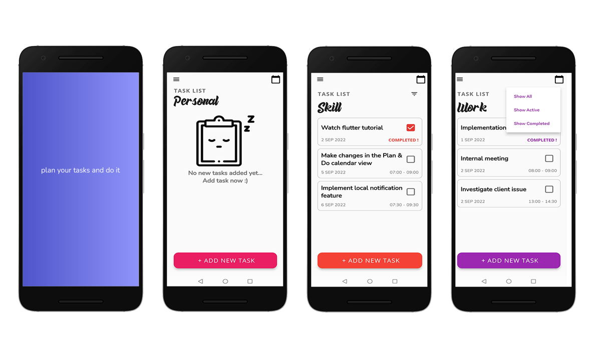
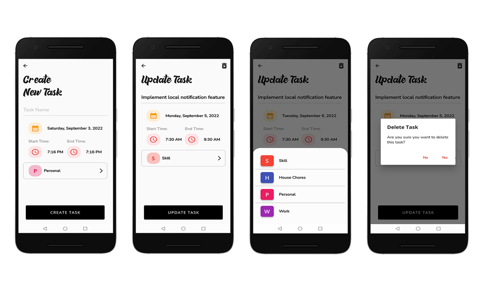
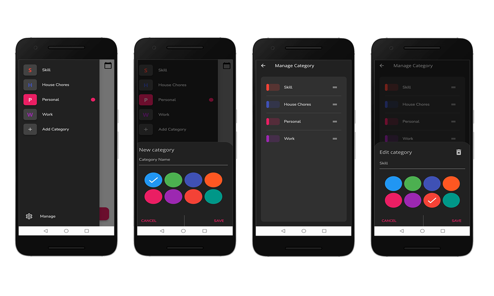
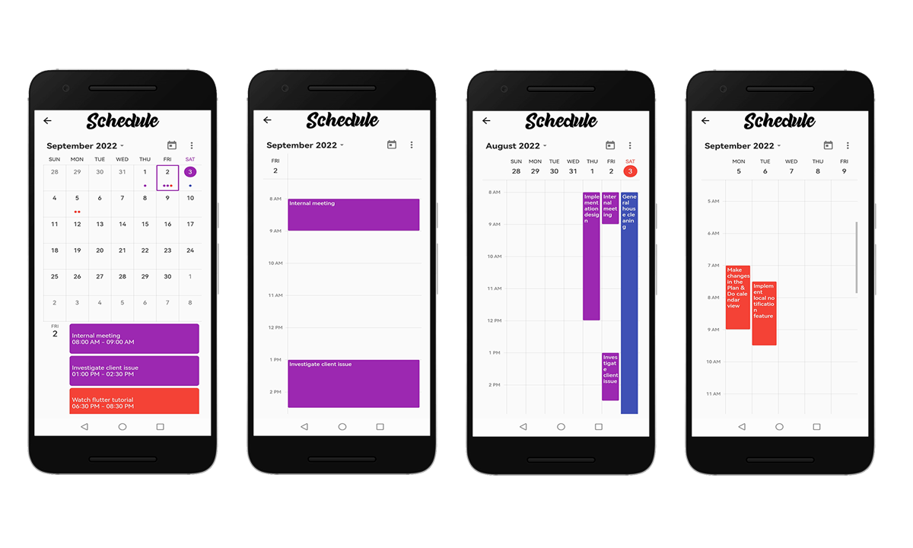

# Plan & Do Mobile App

A simple to do list app with calendar and categories feature made using Flutter with flutter_bloc as state management and sqflite for local storage (Firebase database as online storage).

## Screenshots

